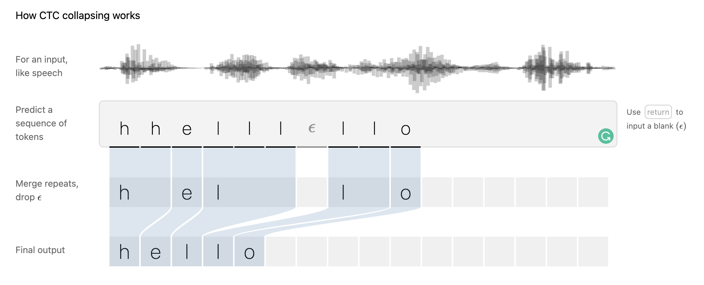
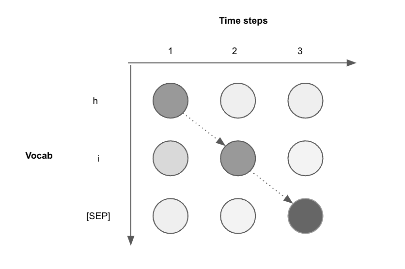

## Introduction

- Connectionist Temporal Classification (CTC) is the algorithm to assign probability score to an output Y given any input X. The main advantage is that the size of X and Y do not have to match!
- This makes CTC an ideal algorithm for use cases like speech recogition and  handwriting recoginition where the input and output do not usually match. 
- Take the example of speech recognition. The input is usually a waveform of audio that could contains 16,000 samples per second (if sampling rate is 16kHz). But in a second, we hardly speak a word that could be 5-6 characters. So in [ASR](stt.md) we are trying to map a large amount of input to much smaller sized output. This is just one of the use cases where CTC shines.

<figure markdown> 
    
    <figcaption>Message collapsing using CTC. [*Created using the tool available here*](https://distill.pub/2017/ctc/)</figcaption>
</figure>

## Understanding CTC

- To understand the CTC algorithm, we need to understand three aspects. Let's go through them one by one. 

### Collapsing

- In ASR, while the output is much smaller, we start with normal classification on the input. For this, we first divide the input into multiple equal sized tokens. For example, we can take 400 samples at a time (for 16kHz sampled audio that is 25ms of speech). Now we need to classify each one of these samples into characters available in the vocabulary. For a normal english language we will have all the alphanumeric characters plus some special tokens (not special characters) as the vocabulary.

!!! note
    In ASR vocab, we do not put any of the special characters for which there is no sound. For example there is no sound for `.`. But we could identify `'` in `It's`, so it could be there. 

- This will give us a long sequence of characters, and this is where collapsing logic of CTC comes into picture. The idea is to combine consecutive repetitive characters together. For example, `hhhhiiiii` could be simply written as `hi`. 
- Now we also want to handle two special cases, (1) there could be spaces between two words, (2) there could be multiple repetitive characters in a valid word like double `l` in `hello`. For these cases, we can add two special tokens in the vocab, say `[BRK]` and `[SEP]` respectively.
- So a word like `hello` could be decoded if we get the classification output as `hhelll[SEP]llo`. This means for a complicated task like ASR, we can continue with a simple classification task at the output layer and later let CTC decoding logic handle the rest. But the next question is, "how can we teach model to predict these outputs?" 🤔

!!! note
    The overall collapsing algorithm is like this -- (1) First, collapse the consecutive characters, (2) Next remove any [SEP] tokens, and (3) Finally replace [BRK] tokens with space.

### Relevant Paths

- For any given sample (time step), the output will be a probability distribution for each character in the vocab *(imagine using softmax)*. 
- Suppose we only have 3 samples (three time steps) and 3 different characters in the vocab, then we can have $3^3=27$ possible paths to choose from. An example is shown below where you could imagine paths (dashed lines) going from any left circle to every circle in the next time step. 

<figure markdown> 
    
    <figcaption>One possible path for transcribing `hi`</figcaption>
</figure>

- One interesting property of CTC is that there could be multiple true possible paths. For CTC to transcribe `hi` any of the following will do -- `hhi`, `hii`, `h[SEP]i`, `hi[SEP]` or `[SEP]hi`. Hence the true relevant paths here are 5 out of all 27 available ones. 
- Looking from the perspective of training neural networks, we want to penalize the irrelevant paths and increase the probability of the relevant ones. This is done by two ways, 
  - We can train to increase the probability of the characters in the relevant paths at the respective time step. In our case, we can increase the probability of `h` and `[SEP]` at the 1st time step as these are the only available choices in set of relevant paths! This can be repeated for the other time steps as well. But this approach has one major con - it is training at time step level and not path level. So even if the probabilities at each step improves, output paths could still not be a relevant one.
  - Another approach is to consider the context of the path by using models like RNN that can compute per step wise probabilities wrt the overall path probability. We take product of probability of all steps in a relevant path ( $\prod_{t=1}^{T}p_t (a_t | X)$ ) and then sum the path probabilities of the relevant paths ( $\sum_{A\epsilon A_{X,Y}}^{}$ ). This gives us the CTC conditional probability, which we want to maximize. 

$$
P(Y|X) = \sum_{A\epsilon A_{X,Y}}^{}\prod_{t=1}^{T}p_t (a_t | X) 
$$

!!! note
    This interesting property of CTC helps us to train ASR model without perfect data annotations, where we will have to assign labels to each individual tokens of input. We just need the input audio stream and the expected output transcription and CTC loss takes care of the rest. In fact, famous deep learning frameworks like [PyTorch has CTCLoss available](https://pytorch.org/docs/stable/generated/torch.nn.CTCLoss.html) for easy use!

### Inference

- Now while we can train the models, we want the model to work during the inference time as well. Here, we won't know the correct transcription and the relevant paths, but we will have to find one. For this we can employ a couple of varieties, 
  - The easiest approach is to go greedy! At each time step, we pick the token with the highest probability. But this could lead to suboptimal outputs as some time steps could have high probability but incorrect predictions. Also remember we trained the model to improve the summation of probabilty for all relevant paths. Now there could be a scenario where one irrelevant path (say `[SEP]ih`) has more probability than all individual paths, but the summation of two relevant paths are higher (say `hi[SEP]` and `hii`).
  - The next approach could be to use Beam search where we keep exploring top N paths, where N is the beam size. To handle the above problem, we can modify the beam search where before selecting the next paths to explore, we consider the summation of the explored paths so far by applying CTC collapsing. More details can be [found here](https://distill.pub/2017/ctc/) and an [implementation is here](https://gist.github.com/awni/56369a90d03953e370f3964c826ed4b0).

## Additional Materials

- [Distill - Sequence Modeling
With CTC](https://distill.pub/2017/ctc/)
- [An Intuitive Explanation of Connectionist Temporal Classification](https://towardsdatascience.com/intuitively-understanding-connectionist-temporal-classification-3797e43a86c)