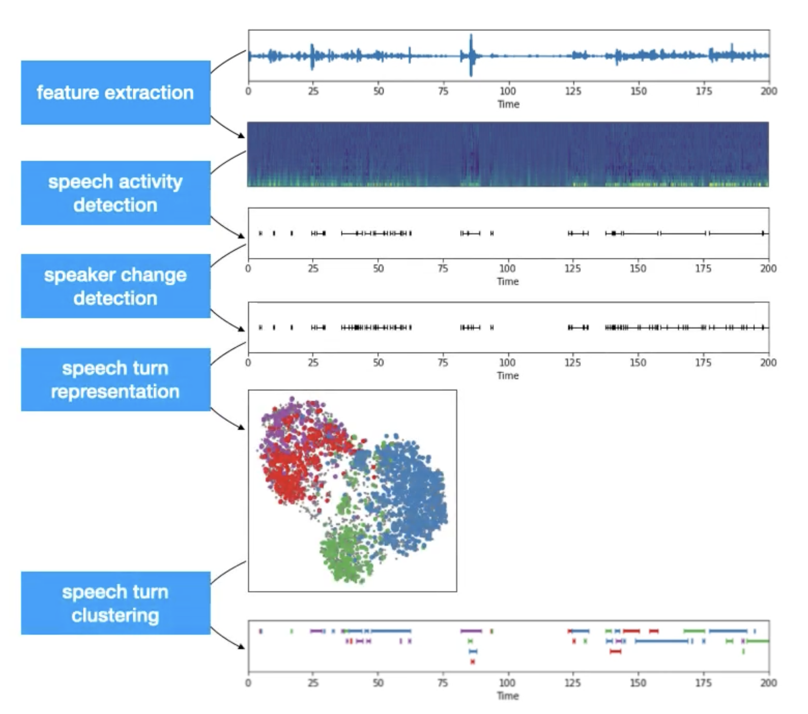

## Introduction

- Speaker Diarization is the process of segregating different speakers from an audio stream. It is used to answer the question "who spoke when?". So if the input is a audio stream with 5 speakers, the output will contain the timestamp in audio when different speakers spoke.
- A sample output for a conversation between 3 people (different speakers) could be,  

```
start=0.2s stop=1.5s speaker_A
start=1.8s stop=3.9s speaker_B
start=4.2s stop=5.7s speaker_A
start=6.2s stop=7.8s speaker_C
...
```
!!! Note
    In speaker diarization we separate the speakers (cluster) and not identify them (classify). Hence the output contains anonymous identifiers like speaker_A, speaker_B, etc and not the actual names of the persons.

## Steps in diarization

<figure markdown> 
    { width="500" }
    <figcaption>The generic approach for Speaker Diarization [1]</figcaption>
</figure>

- Speaker Diarization can be generalised into a 5 step process. These are, 
  - **Feature extraction**: here we transform the raw waveform into audio features like mel spectrogram. 
  - **Voice activity detection**: here we identify the chunks in the audio where some voice activity was observed. As we are not interested in silence and noise, we ignore those irrelevant chunks.  
  - **Speaker change detection**: here we identify the speaker changepoints in the conversation present in the audio. It is either capture by heuristic approach, classical algorithms or modern neural blocks. It will further divide the chunks from last step into subchunks.
  - **Speech turn representation**: here we encode each subchunk by creating feature representations. Recent trends gives preference to neural approach where subchunks are encoded into context aware vector representation. 
  - **Speech turn classification**: here we cluster the subchunks based on their vector representation. Different clustering algorithms could be applied based on availability of cluster count (`k`) and embedding process of the previous step.

- The final output will be the clusters of different subchunks from the audio stream. Each cluster can be given an anonymous identifier *(speaker_a, ..)* and then it can be mapped with the audio stream to create the speaker aware audio timeline.

## Code

- [Pyannote Audio](https://github.com/pyannote/pyannote-audio) provides readymade models and neural building blocks for Speaker diarization and other speech related tasks. While the models are also available on [HuggingFace](https://huggingface.co/pyannote/speaker-diarization), Pyannote is super easy to use. Below is an example from the github repository of the package:

``` python linenums="1"
# instantiate pretrained speaker diarization pipeline
from pyannote.audio import Pipeline
pipeline = Pipeline.from_pretrained("pyannote/speaker-diarization")

# apply pretrained pipeline
diarization = pipeline("audio.wav")

# print the result
for turn, _, speaker in diarization.itertracks(yield_label=True):
    print(f"start={turn.start:.1f}s stop={turn.end:.1f}s speaker_{speaker}")
# start=0.2s stop=1.5s speaker_A
# start=1.8s stop=3.9s speaker_B
# start=4.2s stop=5.7s speaker_A
# ...
```

## References

[1] PyAnnoteAudio - [Code](https://github.com/pyannote/pyannote-audio) | [Paper](https://arxiv.org/abs/1911.01255)