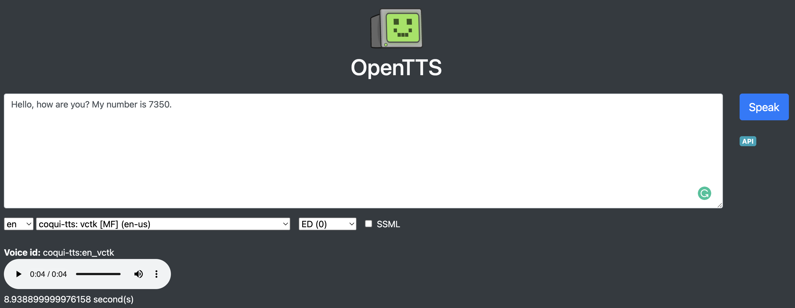

## Introduction

- Text to Speech (TTS) is the process of generating synthesized speech for a given text input. The output is a computer generated audio that sounds and feels like spoken by a human. 
- While the field of speech synthesis is quite old, the accuracy has always been limited. Recently with introduction of neural network based approaches, there has been improvements on multiple fronts like adding languages, ascent and even making the audio seems more like human with necessary pauses and fillers!

``` mermaid
graph LR
  A[Text] -- input --> B[TTS System]
  B -- output --> C[Speech]
```

<figure markdown> 
    { width="500" }
    <figcaption>*man typing on a typewriter that is connected to a loudspeaker; a steampunk painting (Created by DallE)*</figcaption>
</figure>

## Code

- There are lot of open source python package for TTS like [Coqui TTS](https://github.com/coqui-ai/TTS), [Mozilla TTS](https://github.com/mozilla/TTS), [OpenTTS](https://github.com/synesthesiam/opentts), [ESPNet](https://github.com/espnet/espnet), [PaddleSpeech](https://github.com/PaddlePaddle/PaddleSpeech), etc.

### Coqui TTS

- For this tutorial, let's use Coqui TTS as it is one of the simplest package in terms of usability. In fact you just need to install the package with `pip install TTS` and then run the server with `tts-server`, and thats it! It will run a http dashboard on the localhost woth default model and vocoder like shown below, 

<figure markdown> 
    { width="500" }
    <figcaption>Coqui TTS server dashboard</figcaption>
</figure>

- I tried it for `"my name is Mohit"` text and the result is shared below. Btw you can switch to different models or speakers to get different sounding speech.

<audio controls>
  <source src="../../audio/audio_tts_coquitts_speech.wav" type="audio/wav">
Your browser does not support the audio element.
</audio>

- You can check out other models and vocoder available in the package with `tts-server --list_models`. Note, not all models and vocoder pairs are comparable. On top of this, Coqui TTS also provides the option to train and finetune the models further!

### OpenTTS

- Another good package is [OpenTTS](https://github.com/synesthesiam/opentts) that unifies access to multiple open source text to speech systems and voices for many languages.
- One distinctive feature is the partial support to SSML i.e. Speech Synthesis Markup Language. It is a XML-based markup language for assisting the generation of synthetic speech in Web and other applications. One example as shared in their readme is shown below, 

``` xml linenums="1"
<speak>
  The 1st thing to remember is that 27 languages are supported in Open TTS as of 10/13/2021 at 3pm.

  <voice name="glow-speak:en-us_mary_ann">
    <s>
      The current voice can be changed, even to a different text to speech system!
    </s>
  </voice>

  <voice name="coqui-tts:en_vctk#p228">
    <s>Breaks are possible</s>
    <break time="0.5s" />
    <s>between sentences.</s>
  </voice>

  <s lang="en">
    One language is never enough
  </s>
  <s lang="de">
   Eine Sprache ist niemals genug
  </s>
  <s lang="ja">
    言語を一つは決して足りない
  </s>
  <s lang="sw">
    Lugha moja haitoshi
  </s>
</speak>
```

- SSML support can lead to generation of complex and realistic sound as you can add sentence breaks, pauses, handle spelling out of numbers or date, change model or even languages for a single generation!
- The package is quite simple to run. First you need to install `docker`, and then download and run a docker image with `docker run -it -p 5500:5500 synesthesiam/opentts:<LANGUAGE>`, where `<LANGUAGE>` could be any of the 20 supported langauge. To begin with you can try `en`. 
- The downloading will take some time *(more than 5GB is downloaded!)* but once done, you can access the dashboard on `http://localhost:5500` or hit the HTTP APIs on `http://localhost:5500/openapi/`. The endpoint details can be [found here](https://github.com/synesthesiam/opentts#http-api-endpoints) and the complete list of voices generated by the available models is [shared here](https://synesthesiam.github.io/opentts/).

<figure markdown> 
    
    <figcaption>Dashboard of OpenTTS</figcaption>
</figure>

- I tried it for text `"Hello, how are you? My number is 7350."` by selecting the `coqui-tts: vctk` model and `ED (0)` speaker. The output is quite good and shared below, 

<audio controls>
  <source src="../../audio/audio_tts_opentts_speech.wav" type="audio/wav">
Your browser does not support the audio element.
</audio>

## Additional Materials

- [Speech synthesis: A review of the best text to speech architectures with Deep Learning](https://theaisummer.com/text-to-speech/)