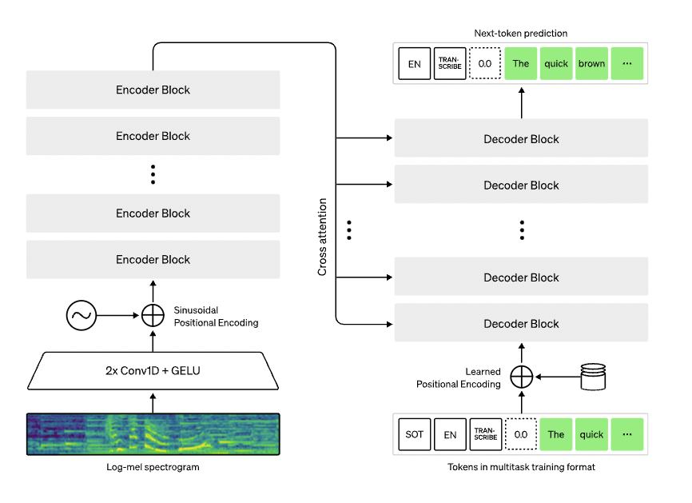
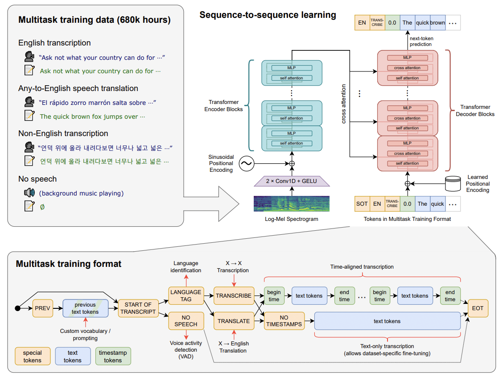
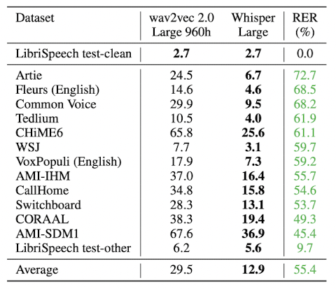

## Introduction

- Whisper is an open source multi-task audio model released by OpenAI. It is an ASR system that works on 97 different languages *(including english)* and can even perform translation from other languages to english. 
- The model was trained on 680,000 hours of multilingual and multitask data collected from the web. Whisper was trained using large scale weak supervision. 
- Here is an interesting perspective for weak supervision training, 
  - There are 3 types of data and training strategies - (1) golden standard data for supervised training, (2) silver standard data for weakly supervised training, and (3) unlabelled data for unsupervised training. 
  - Now, it is difficult to get golden dataset due to human involvement which is costly and time consuming. And model trained on unlabelled datatset with unsupervised strategy lead to mediocre decoder part that needs further finetuning for downstream tasks. 
  - This gives the silver standard dataset a huge advantage, as it is the middle ground with large size and high accuracy.

!!! Note
    As huge portion of silver standard dataset might have had no humans verfication, there is always a room for faulty data. Hence the name - weak supervision.


## Dataset

- Author scraped the internet to collect huge and diverse transcription dataset. As this may also introduce noise, extra care was taken in pre-processing step to clean the data. 
- The intention was to only consider human annotated data, for this any audio-text pair that "seems" like machine generated was removed. For this, they removed normalised transcriptions *(only upper case, only lower case, lack of punctuations, etc)* as they are most likely machine generated *(no human writes like that)*. They even trained language detection models to make sure that there is no mis-match in the audio and text pair's language. Finally, de-duplication was also done.
- With this, overall 680,000 hours was dataset was collected. The breakdown is as follows, 
  - 117,000 hours of non-english 96 different language data.
  - 125,000 hours of X-->en translation data.
  - 438,000 hours of english transcription data.
- Every audio files was resampled at 16,000 Hz and broken in 30 secs chunks to be passed to model for training. Transcription were also broken in the same chunk size respectively. 
  
!!! Note
    The training dataset was not released by OpenAI. But they have open sourced the code and the pretrained models. Evaluation dataset details are [shared here](https://github.com/openai/whisper/tree/main/data)

## Architecture

- Authors picked the [Transformer model](../natural_language_processing/transformer.md) as it has been widely used since its inception in 2017 and it scales reliably. The audio chunk is first converted into 80-channel log-magnitude Mel spectrogram with 25ms window and stride of 10ms. The features are scaled between -1 and 1 with zero mean across the dataset.
  
<figure markdown> 
    { width="700" }
    <figcaption>Transformer inspired Whisper model [1]</figcaption>
</figure>

- The input is first passed to two convolution layers with a filter width of 3 and GELU activation function. Sinusoidal position embeddings are added to the output and it is then passed to the encoder block of Transformer. The decoder block uses learned positional embedding and uses multiple cross-attention layers to apply encoder output. BPE text tokenizer was used like GPT-2.
- The decoder utilises multiple special tokens to facilitate the multi-task output generation. They are,
  - `<|startoftranscript|>` to denote start of prediction
  - `<|nospeech|>` to denote silence or even non-spoken voices (ex: background noise and music)
  - `<|transcribe|>` to denote 'transcription' task
  - `<|translation|>` to denote 'translation' task
  - `<|notimestamps|>` to denote absence of timestamps
  - `<|endoftranscript|>` to denote end of prediction

<figure markdown> 
    { width="700" }
    <figcaption>Overview of Whisper [1]</figcaption>
</figure>

## Results

- The performance of whisper model is very good. On comparing with `wav2vec2 large 960h` model, `whisper large` models makes 55% less errors on average. This is huge! In fact in some cases, even the tiny model performs better than older large models!
  
<figure markdown> 
    { width="500" }
    <figcaption>Comparison of Whisper on various datasets [1]</figcaption>
</figure>

!!! Warning
    Claims on bad performance of Whisper was made in this [Twitter thread](https://twitter.com/lunixbochs/status/1574848899897884672). Here, [Ryan Hileman](https://twitter.com/lunixbochs) compared Whisper with NVIDIA and Talon model on several datasets to find Talon performing well against Whisper models. Also, he noted that Whisper models are quite slow in execution *(even the tiny model)*. Finally, he provided samples for *"catastrophic failures"* of Whisper of following types -- (1) generating complete paragraphs for single word audio input *(like dec, car, two, snake, other)*, (2) hallucinations and repetition in the output.

    Anyone thinking of using Whisper for their project should consider these concerns and test them out themselves before deployment.
## Released Models

- Authors released 5 variety of models based on size, going from 39M param tiny model to 1550M param large model. For each there are is an english only model `{size}.en` (ex: `tiny.en`) and a multilingual model `{size}` (ex: `tiny`). 

|  Size  | Parameters | English-only model | Multilingual model | Required VRAM | Relative speed |
|:------:|:----------:|:------------------:|:------------------:|:-------------:|:--------------:|
|  tiny  |    39 M    |     `tiny.en`      |       `tiny`       |     ~1 GB     |      ~32x      |
|  base  |    74 M    |     `base.en`      |       `base`       |     ~1 GB     |      ~16x      |
| small  |   244 M    |     `small.en`     |      `small`       |     ~2 GB     |      ~6x       |
| medium |   769 M    |    `medium.en`     |      `medium`      |     ~5 GB     |      ~2x       |
| large  |   1550 M   |        N/A         |      `large`       |    ~10 GB     |       1x       |


## Code

- We will go through two ways to use Whisper model. 
  - Authors have released a Python package called `whisper` [1] that makes using the pretrained models as easy as writing 3 lines of code. 
  - OpenAI recently released the API for Whisper model [2] While it a paid service (~$0.36 for 1 hour of audio transcription), they take care of constantly improving the model and hosting complexities. 

### Python Package Inference

- Below is the inference code shared in the Readme of official Github repo [1],
  
``` python linenums="1"
# Install
!brew install ffmpeg # for mac
!pip install git+https://github.com/openai/whisper.git 

# Import
import whisper

# load the model
model = whisper.load_model("base")
# get transcription
result = model.transcribe("audio.mp3", language="english")
# result contains 3 output,
# result['text'] --> complete transcription that with punctuations
# result['segments'] --> segment wise transcription with timestamps and other details 
# result['langauge'] --> detected language of the audio

# can be used for translation as well (here, Japanese to English)
result = model.transcribe("japanese.wav", language="Japanese", task="translate", beam_size=5, best_of=5)
```

!!! Note
    Auto language detection only works if you don't specify it explicitly using `language` param in `transcribe` function. The package uses only the first 30 secs to detect the language.
    Also, whisper's translation is not that accurate hence an alternative approach could be to  perform transcription using Whisper but use [another package](../python/python_snippets.md#machine-translation) to translate the transcription.

- The package also provides CLI support, here is an example, 

``` shell
whisper japanese.wav --language Japanese
# generates --
# txt file (transcription), and 
# vtt file (segment wise transcription with timestamp) 
```

- Finally for the brave souls, we can even play around with the individual modules and perform the transcription step by step, *(from readme [1])*

``` python linenums="1"
# Install
!brew install ffmpeg # for mac
!pip install git+https://github.com/openai/whisper.git 

# import
import whisper

model = whisper.load_model("base")

# load audio and pad/trim it to fit 30 seconds
audio = whisper.load_audio("audio.mp3")
audio = whisper.pad_or_trim(audio)

# make log-Mel spectrogram and move to the same device as the model
mel = whisper.log_mel_spectrogram(audio).to(model.device)

# detect the spoken language
_, probs = model.detect_language(mel)
print(f"Detected language: {max(probs, key=probs.get)}")

# decode the audio
options = whisper.DecodingOptions()
result = whisper.decode(model, mel, options)

# print the recognized text
print(result.text)
```
### OpenAI API

- Before we code, here are some important points to be aware of, 
  - OpenAI hosted Whisper model is recommended to be used for ~59 languages for which the WER rate is <50%, as for others the accuracy will not be good. [Refer](https://platform.openai.com/docs/guides/speech-to-text/supported-languages)
  - Whisper API only supports files that are less than 25 MB. For bigger files, we will have to split or used compressed audio.
  - Finally, we can even use prompt engineering to further improve the accuracy of transcription. It can be used for word boosting, enforcing punctuations, styles and more. [Refer](https://platform.openai.com/docs/guides/speech-to-text/prompting)

!!! Note
    Use of prompt engineering to enhance the transcription accuracy is a relatively newer approach and needs research for more clarity. 

- With that out of the way, using OpenAI API for audio transcription using Whisper is quite easy as shown below, [1]

``` python linenums="1"
# Install
!pip install openai>=0.27.0
#  import 
import openai
# load the audio file
audio_file= open("/path/to/file/audio.mp3", "rb")
# pass for transcription
transcript = openai.Audio.transcribe("whisper-1", audio_file)
```

- For translation you can directly use

``` python linenums="1"
# Install
!pip install openai>=0.27.0
#  import 
import openai
# load the audio file
audio_file= open("/path/to/file/german_audio.mp3", "rb")
# pass for translation 
transcript = openai.Audio.translate("whisper-1", audio_file)
```

- Finally, we can use prompt engineering to enhance the accuracy by using `prompt` param. Below are some examples, 

``` python linenums="1"
# Word Boosting name - 'Mohit' 
transcript = openai.Audio.translate("whisper-1", audio_file, 
    prompt="This transcript may contains people name like Mohit.")
# Enforce puntuations and special characters
transcript = openai.Audio.translate("whisper-1", audio_file, 
    prompt="Hello, this transcript may contains people name like 'Mohit'.")
# Enforce filler words
transcript = openai.Audio.translate("whisper-1", audio_file, 
    prompt="Hmm...this transcript may contains people name like Mohit.")
    
```
## References

[1] Whisper by OpenAI - [Blog](https://openai.com/blog/whisper/) | [Paper](https://cdn.openai.com/papers/whisper.pdf) | [Code](https://github.com/openai/whisper) | [API Doc]([lazydsguide](https://platform.openai.com/docs/guides/speech-to-text))
