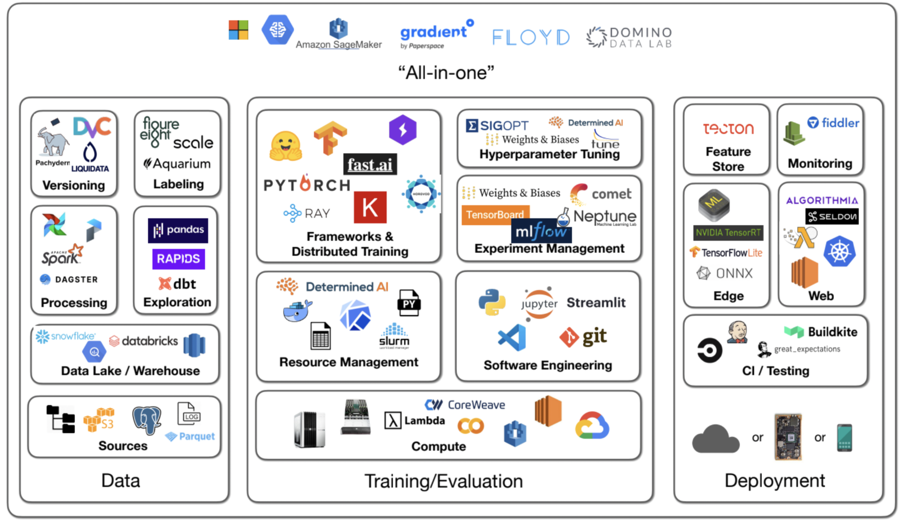

# Introduction

- Several aspiring data scientists think Data science is just about training fancy models. While it's part of the job, what we are missing here is the huge additional effort that is required to make sure that a model is trainable, executable and deployable. Add to it the complexity of working in a team and now we have to make sure the code is well formatted and structured as well. In all, life of a Data scientist is similar to any software engineer, just with a caveat of having the luxury to play with the state-of-the-art AI algorithms once in a while 😄

- Now, the industry is trying (or realizing) the capabilities, limitations and responsibilities of professionals in AI or ML field. This is giving rise to increase in requirements for diverse job profiles like ML engineer, Data Engineer, Data Scientist, Research Scientist, etc. That said, Data scientist (DS) are reinventing themselves as well, giving rise to the interesting profile of "Full stack Data scientists" - who while researching and experiment with AI models, are not afraid to dabble into the old school engineering aspect of the project. This article is for such aspirants or practitioners.

## MLOps tools

- Let's take a quick look into different tools and their segregation based on the where and how they are used,

<figure markdown> 
        
        <figcaption>Different MLOps tools covering Data, Training, Evaluation and Deployment. (*fullstackdeeplearning*)</figcaption>
        </figure>

- The rest of this section will cover some of these tools in detail.

--8<-- "includes/abbreviations.md"
