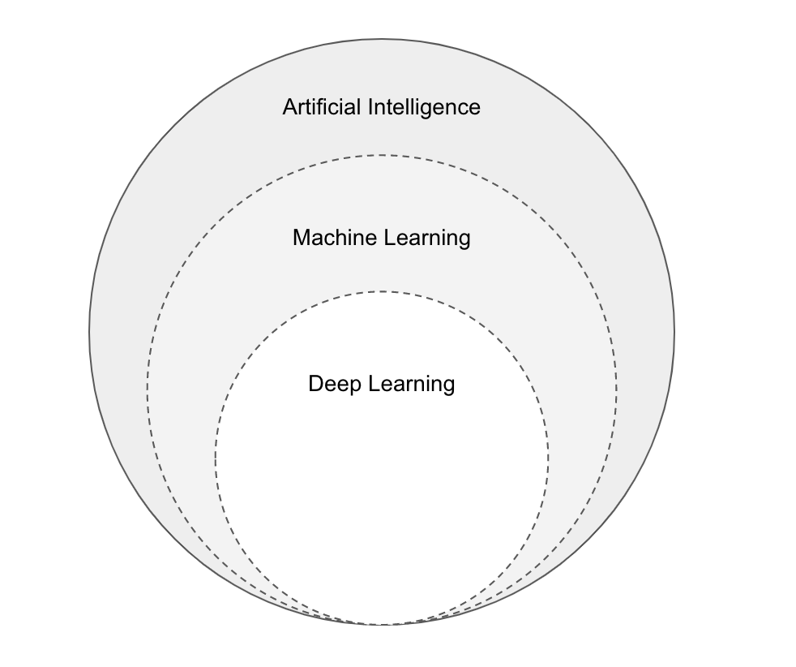

- The first question to ask is **"What is Machine Learning (ML)?"**. And to answer this question we should understand the relation between Artificial Intelligence (AI), Machine Learning (ML) and even Deep Learning (DL). Let's go through them ony by one, 
  - **Artificial Intelligence (AI)** is the process of creating intelligent machines that can perform tasks that humans can do.
  - **Machine Learning (ML)** is subset of AI where we create systems that is able to learn from data and perform specific tasks with near or above human capability.
  - **Deep Learning (DL)** is subset of ML where we create neural network based system that is able to capable of identifying patterns from data and perform specific tasks.

<figure markdown> 
    { width="500" }
    <figcaption>The hierarchy of Artificial Intelligence</figcaption>
</figure>

## Different types of Learning

### Supervised Learning 

- It is a machine learning approach wherein we learn a function that transforms an input into an output based on example input-output pairs. Basically, it uses a labeled dataset as a training dataset to learn a generic function that can be later used to predict unseens data.
- Classification is one of the most common problems for which supervised learning is utilized. The idea is to learn a generic function that takes an item’s features as input and provides the item’s class as output.  To solve this, several classification algorithms try to create boundaries for each class based on the features of labeled data. Later for any new item, the boundaries help decide which class the item belongs to. 
  
### Unsupervised Learning 
- It is a machine learning approach wherein we learn patterns from unlabeled data. It is more of a descriptive analysis that can be used to generate insights from the data, which could be later used for downstream predictions. 
- Clustering is a common example of unsupervised learning. The idea is to make groups of items based on the item’s features. Note, as the data is not labeled, the grouping could be completely different from the user’s expectations. Each clustering algorithm has its own internal similarity function and grouping strategy by which the clusters are formed. 
  
### Semi-Supervised Learning

- It is a machine learning approach wherein we use labeled and unlabeled data to train a model. The intention is that the resulting model will be better than one learned over the labeled (supervised) or unlabeled data (unsupervised) alone. Hence it falls between the two methods. We can try semi-supervised learning when we have very little labeled data but a lot of unlabeled data, and if the cost or time of labeling is too high.
- We start with training a model on the labeled data. Then the model is used to make predictions on the unlabeled data. Specific unlabeled data are picked and their prediction is considered true. The selection criteria could be some threshold on the prediction probability or top K selection. These selected unlabeled data with the prediction are added to the labeled data set and the next iteration of training begins. This goes on till `n-iterations`.

### Reinforcement Learning

- It is a machine learning approach wherein we train agent(s) to interact with an environment to achieve certain goal. The goal is quantified by providing the agent with some positive reward on successful completion or negative reward incase of failure. 
- The main components in RL are agents, environment and actions. Agents are the intelligent model we want to improve over time. Environment is the simulation where the agent performs some actions. Once an agent takes an action, the state of the agent changes. Based on the environment, the agent could get instant reward for each action or delayed reward on completion of an episode (sequence of actions).

### Self-supervised Learning

- It is a machine learning approach wherein we create supervisory signals from the unlabeled data itself, often leveraging the underlying structure in the data. The idea is to take unlabeled data and create generic tasks, that could be different from the intended downstream task but will help model learn the fundamentals. Then the model could be   fine-tuned for the specific downstream task easily with very less labeled data. It is closely connected to how humans learn — as human normally first develop common sense (a general understanding of the world) and then learn specific tasks quite easily (when comparing to machines). 
- It is becoming a norm in the AI field to to train large models using self-supervised learning, as the resulting models are generalist ie. could be used for multiple downstream tasks. The method of training vary wrt the datatype. For example, in NLP, we can hide part of a sentence and predict the hidden words from the remaining words. In CV, we can predict past or future frames in a video (hidden data) from current ones (observed data). Same could be done for Audio.

## Additional materials

- [14 Different Types of Learning in Machine Learning](https://machinelearningmastery.com/types-of-learning-in-machine-learning/)
- [Semi-Supervised Wikipedia](https://en.wikipedia.org/wiki/Semi-supervised_learning) and [Semi-Supervised Sklearn](https://scikit-learn.org/stable/modules/semi_supervised.html)
- [Self-supervised learning: The dark matter of intelligence](https://ai.facebook.com/blog/self-supervised-learning-the-dark-matter-of-intelligence/)