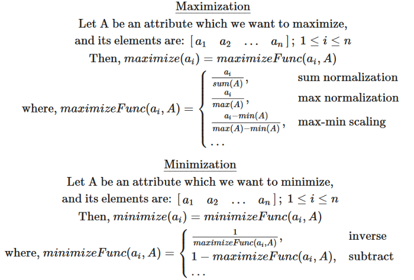
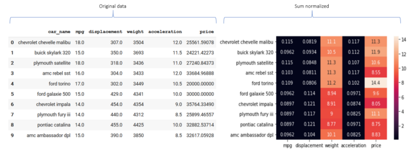
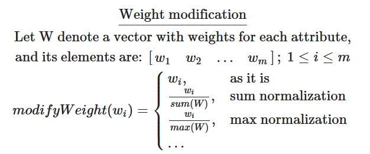

### Introduction

- Suppose you have a decision to make — like buying a house, or a car, or even a guitar. You don’t want to choose randomly or get biased by someone’s suggestion, but want to make an educated decision. For this, you gathered some information about the entity you want to buy (let’s say it’s a car). 
- So you have a list of `N` cars with their price information. As usual, we won’t want to spend more, we can just sort the cars by their price (in ascending order) and pick the top one (with the smallest price), and we are done! This was decision making with a single criterion. 
- But alas if life is so easy :smile: We would also like the car to have good mileage, better engine, faster acceleration (if you want to race), and some more. Here, you want to choose a car with the smallest price, but the highest mileage and acceleration, and so on. This problem can’t be so easily solved by simple sorting. Enter multi-criteria decision-making algorithms! :sunglasses:

<figure markdown> 
    { width="500" }
    <figcaption>an Egyptian painting of a man dissecting a car to understand it better (Created by DallE)</figcaption>
</figure>

### Dataset

- Let’s choose one dataset so it becomes easier to visualize the result, to understand what’s really happening behind the scenes and finally build intuition. 
- For this, I am picking cars dataset. For each car, we will focus on a subset of attributes and only pick 10 rows (unique cars) to make our life easier. Look at the selected data,

<figure markdown> 
    { width="500" }
    <figcaption>10 rows from the cars dataset</figcaption>
</figure>

- Explaining some attributes,
  - `mpg`: a measure of how far a car can travel if you put just one gallon of petrol or diesel in its tank (mileage).
  - `displacement`: engine displacement is the measure of the cylinder volume swept by all of the pistons of a piston engine. More displacement means more power.
  - `acceleration`: a measure of how long it takes the car to reach a speed from 0. Higher the acceleration, better the car for drag racing 🏎️

- Here please notice some points,
  - The unit and distribution of the attributes are not the same. Price plays in thousands of $, acceleration in tens of seconds and so on.

    <figure markdown> 
        { width="500" }
        <figcaption>describing each of the numerical columns (the attributes) of the selected data</figcaption>
    </figure>

  - The logic of best for each attribute vary as well. Here, we want to find a car with high values in mpg, displacement and acceleration. At the same time, low values in weight and price. This notion of high and low can be inferred as maximizing and minimizing the attributes, respectively.

  - There could be an additional requirement where we don’t consider each attribute equal. For example, If I want a car for racing and say I am sponsored by a billionaire, then I won’t care about mpg and price so much. I want the faster and lightest car possible. But what if I am a student (hence most probably on a strict budget) and travel a lot, then suddenly mpg and price become the most important attribute and I don’t give a damn about displacement. These notions of important of attributes can be inferred as weights assigned to each attribute. Say, price is 30% important, while displacement is only 10% and so on.

- With the requirements clear, let’s try to see how we can solve these kinds of problems.

### Generic methodology

- Most of the basic multi-criteria decision solvers have a common methodology which tries to,

  - Consider one attribute at a time and try to maximize or minimize it (as per the requirement) to generate optimized score.
  - Introduce weights to each attributes to get optimized weighted scores.
  - Combine the weighted scores (of each attribute) to create a final score for an entity (here car).

- After this, we have transformed the requirements into a single numerical attribute (final score), and as done previously we can sort on this to get the best car (this time we sort by descending as we want to pick one with maximum score). Let’s explore each step with examples.

#### Maximize and Minimize

- Remember the first point from the dataset section, attributes have very different units and distributions, which we need to handle. One possible solution is to normalize each attribute between the same range. And we also want the direction of goodness to be similar (irrespective of the logic). Hence after normalization, values near maximum of range (say 1) should mean that car is good in that attribute and lower values (say near 0) means they are bad. We do this with the following formula,

<figure markdown> 
    { width="500" }
    <figcaption>normalization logic for maximizing and minimizing an attribute values</figcaption>
</figure>

- Look at the first equation for maximizing, one example is update mpg of each car by dividing it by sum of mpg of all cars (sum normalization). We can modify the logic by just considering the max of mpg or other formulae itself. The intention is, after applying this to each attribute, the range of each attribute will be the same as well as we can infer that value close to 1 means good.

- The formulae for minimizing is nearly the same as the maximizing one, we just inverse it (1 divided by maximize) or mirror it (by subtracting it from 1) to actually reverse the goodness direction (otherwise 1 will mean bad and 0 will mean good). Let’s see how it looks after in practice,


<figure markdown> 
    
    <figcaption>Example for sum normalization heatmap of the original data. Check the ‘mpg’ value of ‘ford torino’. Originally its 17 but after sum normalization, it should be 17/156=0.109. Similarly, the ‘price’ is 20k, after inverse it will be 1/(20k/287872) = 14.4</figcaption>
</figure>

#### Apply weights

- We just need to superimpose the weight over the optimized scores, which can be easily done by multiplying the weights to the optimized score. Here as well we can introduce different types of normalization,

  - `as it is`: directly multiple the weights to optimized score
  - `sum`: normalize the weights by sum logic (discussed above) then multiply.
  - `max`: normalize by max logic, then multiply.

<figure markdown> 
    
    <figcaption>weight modification logic</figcaption>
</figure>


#### Combine the scores

- Finally, we combine the score to make it one. This can be done by two different logic,

  - `sum`: add all individual scores together
  - `product`: multiply all individual scores together. In fact, many implementations add the logarithm of the value instead of taking products, this is done to handle very smaller result when multiplying small values.

### Implementation

!!! Note
    **Update - March 2022:** Due to code breaking changes in the latest version of scikit-criteria, it is recommended to use v0.2.11 of the package for the code discussed in the article. Code repository is here.

- We have a python package named [skcriteria](https://scikit-criteria.quatrope.org/en/latest/index.html) that provides many algorithms for multi criteria decision-making problem. Actually two algorithms inside the `skcriteria.madm.simple` module are,

  - `WeightedSum` — individual score combine logic is sum
  - `WeightedProduct` — individual score combine logic is product (sum of log)

- And both of these methods take two parameters as input,

  - `mnorm` — define value maximize normalization logic (minimization is always the inverse of the same maximize logic).
  - `wnorm` — define weight normalization logic

- To perform ranking on our data, first, we need to load it as their `skcriteria.Data` object by,

``` python linenums="1"
criteria_data = Data(
    cars_data.iloc[:, 1:],          # the pandas dataframe
    [MAX, MAX, MIN, MAX, MIN],      # direction of goodness for each column
    anames = cars_data['car_name'], # each entity's name, here car name
    cnames = cars_data.columns[1:], # attribute/column name
    # weights=[1,1,1,1,1]           # weights for each attribute (optional)
    )
```

| ALT./CRIT.                | mpg (max) | displacement (max) | weight (min) | acceleration (max) | price (min) |
|---------------------------|-----------|--------------------|--------------|--------------------|-------------|
| chevrolet chevelle malibu |        18 |                307 |         3504 |                 12 |     25561.6 |
| buick skylark 320         |        15 |                350 |         3693 |               11.5 |     24221.4 |
| plymouth satellite        |        18 |                318 |         3436 |                 11 |     27240.8 |
| amc rebel sst             |        16 |                304 |         3433 |                 12 |       33685 |
| ford torino               |        17 |                302 |         3449 |               10.5 |       20000 |
| ford galaxie 500          |        15 |                429 |         4341 |                 10 |       30000 |
| chevrolet impala          |        14 |                454 |         4354 |                  9 |     35764.3 |
| plymouth fury iii         |        14 |                440 |         4312 |                8.5 |     25899.5 |
| pontiac catalina          |        14 |                455 |         4425 |                 10 |     32882.5 |
| amc ambassador dpl        |        15 |                390 |         3850 |                8.5 |     32617.1 |

- With the data loaded, all we need to do is call the appropriate decision maker function with data object and parameter settings. The output has one additional rank column to show the final ranking by considering all of the mentioned criteria.

``` python linenums="1"
from skcriteria.madm import simple
# weighted sum
dm = simple.WeightedSum(mnorm="sum")
dec = dm.decide(criteria_data)
```

|         ALT./CRIT.        | mpg (max) | displacement (max) | weight (min) | acceleration (max) | price (min) | Rank |
|:-------------------------:|:---------:|:------------------:|:------------:|:------------------:|:-----------:|:----:|
| chevrolet chevelle malibu |     18    |         307        |     3504     |         12         |   25561.6   |   3  |
|     buick skylark 320     |     15    |         350        |     3693     |        11.5        |   24221.4   |   2  |
|     plymouth satellite    |     18    |         318        |     3436     |         11         |   27240.8   |   4  |
|       amc rebel sst       |     16    |         304        |     3433     |         12         |    33685    |   6  |
|        ford torino        |     17    |         302        |     3449     |        10.5        |    20000    |   1  |
|      ford galaxie 500     |     15    |         429        |     4341     |         10         |    30000    |   8  |
|      chevrolet impala     |     14    |         454        |     4354     |          9         |   35764.3   |  10  |
|     plymouth fury iii     |     14    |         440        |     4312     |         8.5        |   25899.5   |   5  |
|      pontiac catalina     |     14    |         455        |     4425     |         10         |   32882.5   |   9  |
|     amc ambassador dpl    |     15    |         390        |     3850     |         8.5        |   32617.1   |   7  |

- We can even export the final score by `dec.e_.points` and the ranks by `dec.rank_`.

### Comparison

- Let’s compare the result of different decision making algorithms (with different parameters) on our dataset. To do so, I use the weightedSum and weightedProduct implementations (once with max and then with sum value normalization). I also implemented a normalize_data function which by default performs minmax and subtract normalization. Then I apply a sum combine on the output.


``` python linenums="1"
# import
from skcriteria.madm import simple

# make a copy of original dataset
cars_data_copy = cars_data.copy()

# weighted sum, sumNorm
dm = simple.WeightedSum(mnorm="sum")
dec = dm.decide(criteria_data)
cars_data_copy.loc[:, 'rank_weightedSum_sumNorm_inverse'] = dec.rank_

# weighted sum, maxNorm
dm = simple.WeightedSum(mnorm="max")
dec = dm.decide(criteria_data)
cars_data_copy.loc[:, 'rank_weightedSum_maxNorm_inverse'] = dec.rank_

# weighted product, sumNorm
dm = simple.WeightedProduct(mnorm="sum")
dec = dm.decide(criteria_data)
cars_data_copy.loc[:, 'rank_weightedProduct_sumNorm_inverse'] = dec.rank_

# weighted product, sumNorm
dm = simple.WeightedProduct(mnorm="max")
dec = dm.decide(criteria_data)
cars_data_copy.loc[:, 'rank_weightedProduct_maxNorm_inverse'] = dec.rank_

# min max scale + mirror
cars_data_copy.loc[:, 'rank_weightedSum_minmaxScale_subtract'] =\
     pd.Series(normalize_data().sum(axis=1)).rank(ascending=False).astype(int)
```

- Finally, I plot a parallel coordinate graphs, where each axis(vertical line) denotes one solver type and the values denote the rank of a car by that solver. Each line is for one car and going from left to right, it shows the journey — how the rank of a car changes as you switch among different solvers.

<figure markdown> 
    
    <figcaption>Journey of a car as we switch decision solver</figcaption>
</figure>

- Some points to consider,

  - Ford Torino is rank 1 (car with the highest score) for 4/5 solvers. Minmax favors Chevrolet Malibu.
  - Impala is the universal low ranker :(
  - Both implementations of weightedProduct is giving the same ranking to all cars. Nothing interesting here.
  - High variance in the rankings of both the weightedSum implementations.
  - MinMax gives the most diverse rankings for top 4 guys.

- The main reason behind the variance of result when changing the normalization (from sum to max) is due to the translation done on the original data. This translation changes the range of data (like scales everything between x and y ) and in case of inverse modifies the linearity as well (say, equal steps of 1 in original data is not consistent in transformed data). This will become more clear by following result,

``` python linenums="1"
import numpy as np
x = np.array(range(1, 10))
print("X: ", x)
print("MinMax: ", minmax_scale(x))
print("MinMax_subtract: ", 1 - minmax_scale(x))
print("sumNorm: ", x/sum(x))
print("sumNorm_inverse: ", (1/(x/sum(x))))
print("maxNorm: ", x/max(x))
print("maxNorm_inverse: ", 1/(x/max(x)))

## Output
X:  [1 2 3 4 5 6 7 8 9]

MinMax:  [0.    0.125 0.25  0.375 0.5   0.625 0.75  0.875 1.   ]
MinMax_subtract:  [1.    0.875 0.75  0.625 0.5   0.375 0.25  0.125 0.   ]

sumNorm:  [0.02222222 0.04444444 0.06666667 0.08888889 0.11111111 0.13333333
 0.15555556 0.17777778 0.2       ]
sumNorm_inverse:  [45.         22.5        15.         11.25        9.          7.5
  6.42857143  5.625       5.        ]

maxNorm:  [0.11111111 0.22222222 0.33333333 0.44444444 0.55555556 0.66666667
 0.77777778 0.88888889 1.        ]
maxNorm_inverse:  [9.         4.5        3.         2.25       1.8        1.5
 1.28571429 1.125      1.        ]
```

- Here, input data consist numbers 1 to 9 (notice, the difference between any two consecutive number is 1 i.e. step is same). Approach one (minmax) translates the data between 0 and 1 and the step is still the same. Now look at minimization logic ( `_inverse` ) of approach 2 and 3. Here at the start (low original values) the step is nearly the half of the last element, but near the end (high original value) the step is very small, even though in the original data we are moving with same step of 1.

- Because of this, in case of minimization, a very high score is given to “good” cars (with low values) and even a small impurity matter (when minimized, high value = low score) and results in a drastic decrease in score. It’s like we are being very picky, either you are the best or you get half the score :) On the other hand, for higher values, small impurities doesn’t matter. If the car is already bad by that attribute, then we don’t care if its value is 7 or 8 or 9 and the reduction in the score is much less! We can use this understanding to pick the right decision solver with the right parameter as per our need.

### Conclusion

- This article has just touched the surface of the multi-criteria decision making domain. Even in skcriteria package there are many more algorithms like TOPSIS and MOORA which have quite a different intuition to solve these problems. But even then the notion of goodness and the idea to handle individual attributes to finally combine them all together is used in many of them. So maybe we will explore more algorithms in another article.

- But the major takeaways from this article should be to understand the why and what of decision makers. That each such decision can be manipulated by multiple criteria. And also that we may have a different notion of goodness and importance assigned to each criterion. Finally, we have different varieties of solvers that can be build by taking permutation of logic and parameters, and nearly all of them give different and interesting results based on our need!

Cheers :wave:
