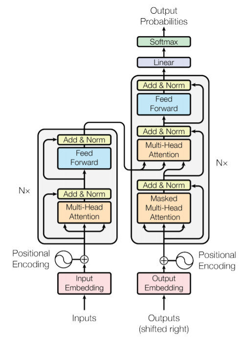
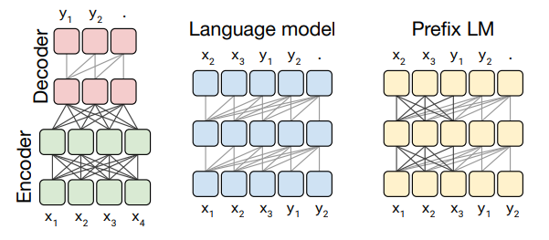
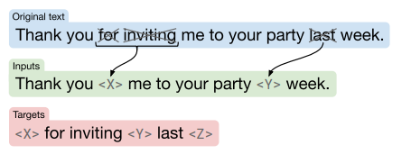

T5
=========

## Introduction

- T5 stands for "Text-to-Text Transfer Transformer". It was released by Google on 2020. As the name suggests, it's a tranformer based language model used for text generation. For more details about other text generation models, refer the [Text Generation](text_generation.md) chapter. 
- In contrast to other famous Transformer based models like BERT or GPT, which is made up of either the encoder or decoder part of the Transformer, T5 paper showcase that using the complete encoder-decoder architecture is better than only using decoder. Apart from this, the paper also curated and released  Colossal Clean Crawled Corpus (C4) -  a huge crawled and cleaned dataset for pre-training language model using self-supervised learning. (*raffel2020exploring*) 

<figure markdown> 
        
        <figcaption>Transformer architecture. Left part is the encoder, right part is the decoder. T5's architecture is very similar to this one. (*vaswani2017attention raffel2020exploring*)</figcaption>
        </figure>

- Some example tasks that can be performed using T5 is shown below, 

<figure markdown> 
        
        <figcaption>T5 text-to-text framework examples. See: [Google Blog](https://ai.googleblog.com/2020/02/exploring-transfer-learning-with-t5.html)</figcaption>
        </figure>

## Paper details

### Transformer Architecture 

- To compare different architectures suitable for languague models, T5 considered basically three varieties,
  - **Left:** A standard encoder-decoder architecture uses fully visible masking in the encoder and the encoder-decoder attention, with causal masking in the decoder.
  - **Middle:** A language model consists of a single Transformer layer stack and is fed the concatenation of the input and target, using a causal mask throughout.
  - **Right:** Adding a prefix to a language model corresponds to allowing fully-visible masking over the input.

- As suggested before, T5 found the left i.e. transformer based architecture to perform better than others.

<figure markdown> 
        
        <figcaption>Schematics of the Transformer architecture variants considered by T5 paper. (*raffel2020exploring*)</figcaption>
        </figure>

### Pre-training Strategy 

- T5 is trained with multi-task learning methodology, where the idea is to club multiple tasks while pre-training the model. These multiple tasks are further clubbed into two groups based on how they are trained, 
  - **Unsupervised training:** this includes training on the C4 dataset using the classic language model training with maximum likelihood objective.
  - **Supervised training:** this includes adding several NLP based tasks like question-answering, summarization, classification, etc. The model is trained with the curated training data in a supervised fashion, but all these tasks are transformed to work with text-in text-out format as suitable for languague models.

!!! note
    T5 authors also released checkpoint models which are only unsupervised trained on the C4 dataset. More details and model is available [here](https://github.com/google-research/text-to-text-transfer-transformer/blob/main/released_checkpoints.md). 

- T5 also compared different unsupervised objectives i.e. different training stratigies for unsupervised training which could lead to better performance. A visual guide to the search space is shown below.

<figure markdown> 
        
        <figcaption>A flow chart of the exploration of unsupervised objectives by the T5 paper. (*raffel2020exploring*)</figcaption>
        </figure>

- To begin with, there were three High-level approaches, (1) **Language modeling:** where you take predict the next word based on historical words, (2) **BERT-style:** where you mask certain words and model predict those masked words, or (3) **Deshuffling:** where you shuffle the sentence and model predicts the unshuffled correct sentence as output. After experimenting with these BERT-style approach gave the best result and hence was selecte for next level of analysis.
-  Next, different corruption startegies were tried. Originally BERT proposed MASD based approach but for language model setting, T5 authors observed Replace span works better. In replace span you mask consecutive tokens and language model predicts the masked spans.

<figure markdown> 
        
        <figcaption>Span corruption used for unsupervised training in T5. (*raffel2020exploring*)</figcaption>
        </figure>
- Finally, different rate of corruption rate and corruption span length were experimentally selected.

### Performance score

- T5 paper reports following performance score on different datasets,

<figure markdown> 
        
        <figcaption>T5 performance score on different datasets. (*raffel2020exploring*)</figcaption>
        </figure>

## Code

### T5 finetuning

- Tweet sentiment data can be downloaded from [here](https://www.kaggle.com/kazanova/sentiment140)
- Some differences from training other text generation models (due to the [SimpleT5](https://github.com/Shivanandroy/simpleT5) package),
    - We don't need the `Dataset` class, as SimpleT5 works directly on pandas dataframe. Hence we load the data, do some initial pre-processing, split the data and return the pandas dataframe. *(no need to tokenize, create Dataset class, isn't this great!?)*
    - One more point to note is that we do not need to create prompt formats for this package. This way we can separate out the input tweet and sentiment label into different columns, here `source_text` and `target_text`, respectively *(Line 29 and 30)*.

``` python linenums="1"
# load the best model
last_epoch_model = "..." # put the name here
model.load_model("t5", last_epoch_model, use_gpu=True)

# for each test data perform prediction
predictions = []
for index, row in test_df.iterrows():
    prediction = model.predict(row['source_text'])[0]
    predictions.append(prediction)

# computer performance
df = test_df.copy()
df['predicted_label'] = predictions
df['original_label'] = df['target_text']
print(f1_score(df['original_label'], df['predicted_label'], average='macro'))
```

## Additional materials

- Exploring Transfer Learning with T5: the Text-To-Text Transfer Transformer - [Link](https://ai.googleblog.com/2020/02/exploring-transfer-learning-with-t5.html)

--8<-- "includes/abbreviations.md"