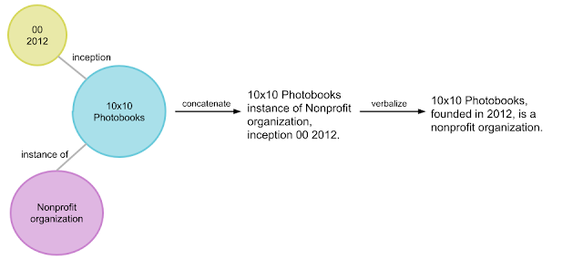

!!! warning
    This page is still under progress. Please check back after some time or [contact me](mailto:mohitmayank1@gmail.com)

## Introduction

- Data to Text generation is a task with structured data as input and unstructured text as output. As an example, consider the use case of trying to summarize a table data, where table is the input and text as output.

- KELM [3] is an interesting example. In [the paper](https://arxiv.org/abs/2010.12688), the authors try to train a language model using Knowledge graph triplets. But as a KG stores structured data, the first task done by authors was to create subgraphs of KG and verbalize it *(as shown below)*

<figure markdown> 
    
    <figcaption>An example illustration of converting an entity subgraph (in bubbles) into synthetic natural sentences (far right). [3]</figcaption>
</figure>

- For this they *"developed a verbalization pipeline named “Text from KG Generator” (TEKGEN), which is made up of the following components: a large training corpus of heuristically aligned Wikipedia text and Wikidata KG triples, a text-to-text generator (T5) to convert the KG triples to text, an entity subgraph creator for generating groups of triples to be verbalized together, and finally, a post-processing filter to remove low quality outputs. The result is a corpus containing the entire Wikidata KG as natural text, which we call the Knowledge-Enhanced Language Model (KELM) corpus. It consists of ~18M sentences spanning ~45M triples and ~1500 relations."* [3]

## References

[1] [NLP Progress - Data-to-Text Generation](http://nlpprogress.com/english/data_to_text_generation.html)

[2] [The 2020 Bilingual, Bi-Directional WebNLG+ Shared Task: Overview and Evaluation Results (WebNLG+ 2020)](https://aclanthology.org/2020.webnlg-1.7/)

[3] [KELM: Integrating Knowledge Graphs with Language Model Pre-training Corpora](https://ai.googleblog.com/2021/05/kelm-integrating-knowledge-graphs-with.html)