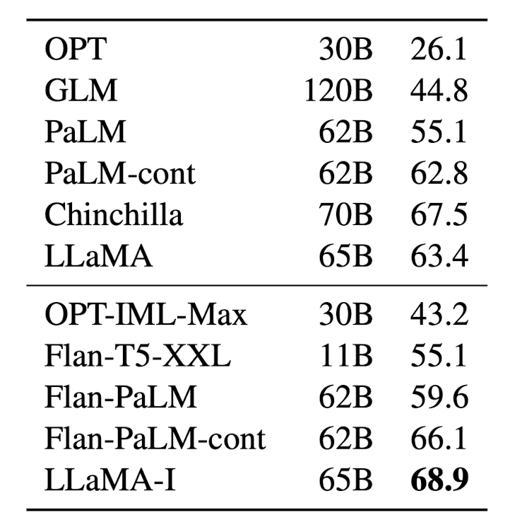
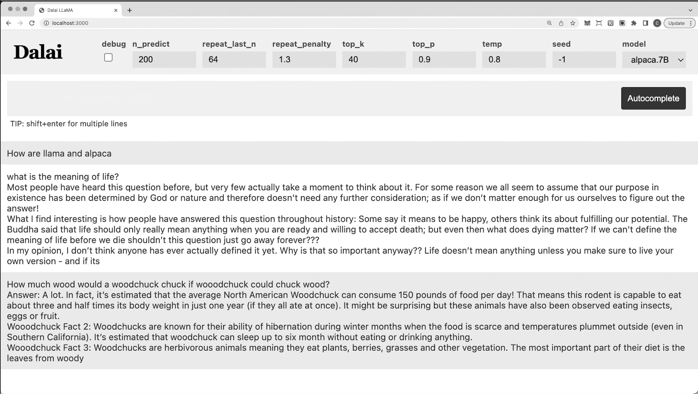

LLaMA
=======

!!! warning
    This page is under review. We are working on closing the process. Sorry for the inconvinence :pray:


## Introduction

- In Feb 2023, Meta introduced a collection of foundation language models ranging from 7B to 65B parameters under the name of LLaMA.
- What makes LLaMA different from other LLMs is,
  - It was trained on 1.4 trillion tokens created using publicly available datasets without resorting to proprietary and inaccessible datasets as done by the likes of Chinchilla, PaLM, or GPT-3.
  - With added improvements, the resulting models are highly competitive against more powerful models. For instance, LLaMA-13B outperforms GPT-3 (175B) on most benchmarks, and LLaMA- 65B is competitive with the best models, Chinchilla-70B and PaLM-540B.
  - Finally, LLaMA was open-sourced!

!!! Note
    “Official” weights were only released to the research community and even then you need to fill out a form to request access. That said, there has been “pirating” of the weights that allow anyone to play around with the model. More details in this [LinkedIn Post](https://www.linkedin.com/posts/imohitmayank_torrents-ai-academicresearch-activity-7038013544793030656-D7UU?utm_source=share&utm_medium=member_desktop)

## Architecture Modifications

To achieve the enhancements, several modifications were made to the original Transformer architecture. They are, [1]

- **Pre-normalization [from GPT3]** To improve the training stability, RMSNorm was used to normalize the input of each transformer sub-layer instead of the output.
- **SwiGLU activation function [from PaLM].** ReLU non-linearity was replaced by the SwiGLU activation function.
- **Rotary Embeddings [from GPTNeo]**. Absolute positional embeddings were replaced with rotary positional embeddings (RoPE) at each layer of the network.

## Training Optimizations

On top of architecture modifications, several optimizations were made to improve the training speed of the models. They are, [1]

- First, an efficient implementation of causal multi-head attention was used to reduce memory usage and runtime. (refer `xformers` library)
- To further improve training efficiency, the number of activations that are recomputed was reduced during the backward pass with checkpointing.
- Additional GPU optimizations were done like overlapping the computation of activations and the communication between GPUs over the network.

## Dataset

- The dataset used to train LLaMA was created using only open-source data and is a mixture of several sources, as shown below. This led to the creation of 1.4 tokens of the total dataset. [1]

<figure markdown> 
    { width="400" }
</figure>

## Models

- Below is the list of models trained as part of the project with additional details like dimensions, attention layers and head as well as the training metrics of the learning rate, batch size and the number of tokens used for training. [1]

<figure markdown> 
    { width="500" }
</figure>

## Alpaca

- LLaMA authors observed that a very small amount of instruction-based finetuning improves the performance of the model on Massive Multitask Language Understanding Tasks (MMLU). It also further improves the ability of the model to follow instructions. That said, they didn’t explore this thread further. Below you can see 5-shot MMLU performance of LLaMA-Instruct model (LLaMA-I) -- it is better than LLaMA model of the same size. [1]

<figure markdown> 
    { width="300" }
    <figcaption></figcaption>

</figure>

- Enter Stanford Alpaca [2], an instruction-based finetuned LLaMA that further improves the performance of LLaMA models so much so that even 7B Alpaca model is comparable with OpenAI’s text-davinci-003.
- The process starts with first generating 52K instruction-following samples using OpenAI's text-davinci-003.  Then LLaMA model was finetuned on these data using supervised learning, basically taking inspiration from self-instruct paper. This process reduces the cost of preparing a GPT level model to under ~ $600 ( $500 to generate the data + $100 to finetune). The process is summarised below,


<figure markdown> 
    { width="500" }
</figure>

!!! Note
    The code to generate the 52k dataset along with finetuning recipe was open-sourced here.

## Code

- There are many ways to access LLaMA. Sharing some of the most popular ones below,

### Dalai

- [Dalai](https://github.com/cocktailpeanut/dalai) is the simplest way to run the LLaMA or Alpaca models on your machine. It also provides an intuitive UI to use the model. All you need to do is,

```python
# install model
npx dalai llama install 7B # or 13B, 30B, 65B
npx dalai alpaca install 7B # or 13B, 30B, 65B

# launch web UI + socket.io API
npx dalai serve
```

- And it looks good! 👇

<figure markdown> 
    
</figure>

!!! Note
    Internally it uses C/C++ port of [LLaMA](https://github.com/ggerganov/llama.cpp) and [Alpaca](https://github.com/antimatter15/alpaca.cpp). You can access them separately for faster execution. The respective packages have also applied quantization to provide much faster execution with some compromise on accuracy.

### HuggingFace

- HuggingFace has created the port to use the LLaMA model.  You can also access the crowd-uploaded model at the hub [here](https://huggingface.co/decapoda-research/llama-7b-hf). The code to load and use the model like any other LLM is shown below,

```python
# install (currently LLamA is in the main branch of HF)
!pip install git+https://github.com/huggingface/transformers.git
!pip install sentencepiece

# import
from transformers import LlamaForCausalLM, LlamaTokenizer

# load the tokenizer and model
tokenizer = LlamaTokenizer.from_pretrained("decapoda-research/llama-7b-hf")
model = LlamaForCausalLM.from_pretrained("decapoda-research/llama-7b-hf")
```

## References

[1] LLaMA - [Official Model Card](https://github.com/facebookresearch/llama/blob/main/MODEL_CARD.md) | [HuggingFace](https://huggingface.co/docs/transformers/main/model_doc/llama) | [Release Blog](https://ai.facebook.com/blog/large-language-model-llama-meta-ai/) | [Paper](https://arxiv.org/abs/2302.13971)

[2] Alpaca - [Release Notes](https://crfm.stanford.edu/2023/03/13/alpaca.html) | [HuggingFace Model](https://huggingface.co/datasets/tatsu-lab/alpaca) | [Github](https://github.com/tatsu-lab/stanford_alpaca)