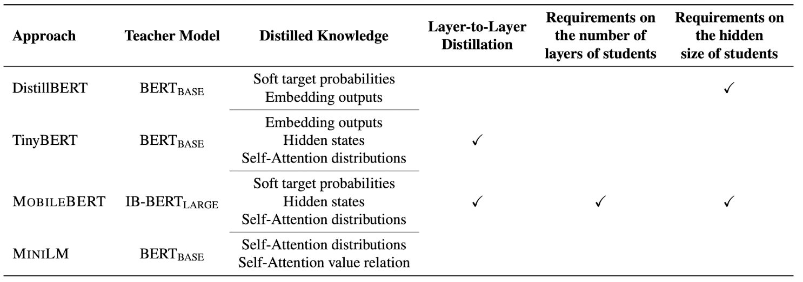
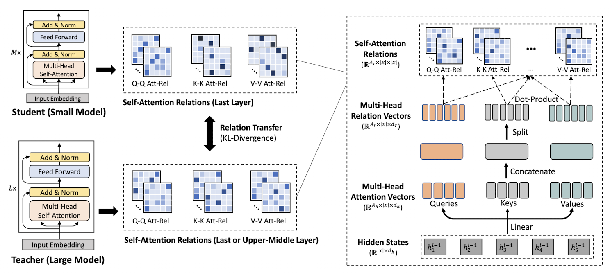

!!! warning
    This page is still under progress. Please check back after some time or [contact me](mailto:mohitmayank1@gmail.com)

## Introduction

- Knowledge distillation is the process of compressing the knowledge of a large model (teacher) into a smaller one (student). MiniLM [1,2,3] proposes novel approaches to perform distillation of large models like BERT and RoBERTa into smaller models that could be 99% acccurate on certain tasks while being more than 2 times faster in inference!
- Apart from sharing details on the distillation process, authors also open-sourced the distilled models at [3]. While the teacher models were encoder models, the author proposes MiniLM can be used for NLU *(ex: extractive QA)* as well as NLG tasks *(ex: abstractive summarization)*. For NLG task, authors followed UniLM paper and used masked attention layers.

## MiniLM

- The first MiniLM paper [1] was published in 2019, and the laid the foundation of the efficient distillation of large NLP models. Distillation of BERT model has been done before in DistillBERT, TinyBERT and MobileBERT. Here is how MiniLM was different, 
  - They proposed dual approach of distillation, (1) Use the original teacher for distillation if student has same number of layers but different hidden size, (2) **use an intermediate teacher assistant** if student has even reduced number of layers. Shown below is the example where `L` and `M` are the number of layers, `d` and `di` is the hidden size in teacher and student respectively. This teacher assistant method is suggested if, $M \le \frac{1}{2} L$ and $di \le \frac{1}{2} d$.
  
  ``` mermaid
    graph LR
    A("Teacher (L, d)") -- distil --> B("Teacher Assistant (L, di)")
    B -- distil --> C("Student (M, di)")
  ```

  - Additionally, relation based **distillation of only the last Transformer layer** was performed rather than other intermediate layers. This lead to flexible architecture creation for student models, where the number of layers could be less than teacher's.
  - Finally, they also proposed dual attention transfer i.e Q-K and V-V. For distillation they compared the KL loss between the last transformer layer of teacher and student. Below is the overview diagram,

<figure markdown> 
    
    <figcaption>Overview of Deep Self-Attention Distillation [1]</figcaption>
</figure>

- Here is the comparison of the existing distillation methods with MiniLM wrt the approach and performance on different datasets. 

<figure markdown> 
    
    <figcaption>Comparison with previous task-agnostic Transformer based LM distillation approaches. [1]</figcaption>
</figure>

<figure markdown> 
    
    <figcaption>MiniLM performance comparision with existing distilled models [1]</figcaption>
</figure>


- Here is a comparison of different distilled MiniLM model against the BERT-Base model [3]. As visible, even with more than 3x reduction in parameters, the accuracy is quite good, sometimes even better!

|      Model      | #Param | SQuAD 2.0 | MNLI-m | SST-2 | QNLI | CoLA |  RTE | MRPC |  QQP |
|:---------------:|:------:|:---------:|:------:|:-----:|:----:|:----:|:----:|:----:|:----:|
| BERT-Base       | 109M   | 76.8      | 84.5   | 93.2  | 91.7 | 58.9 | 68.6 | 87.3 | 91.3 |
| MiniLM-L12xH384 | 33M    | 81.7      | 85.7   | 93.0  | 91.5 | 58.5 | 73.3 | 89.5 | 91.3 |
| MiniLM-L6xH384  | 22M    | 75.6      | 83.3   | 91.5  | 90.5 | 47.5 | 68.8 | 88.9 | 90.6 |

## MiniLMv2

- MiniLMv2 [2] was published in 2021, and here is how it was an enhancement wrt MiniLMv1, 
  -  It generalize deep self-attention distillation in MiniLMv1 [1] by using self-attention relation distillation for task-agnostic compression of pre-trained Transformers. The proposed method **eliminates the restriction on the number of student’s attention heads**. 
  - Authors performed teacher layer selection strategy. In MiniLMv1, knowledge from teacher's last layer was transfered to student's last layer. In MiniLMv2, while the transfer still happened to student's last layer, teacher's layer changes,
    - For BERT-large, 21st layer in teacher model was used for transfer
    - For RoBERTa-large and XML-R-large, 19th layer in teacher model was used for transfer
    - For base sized models, laster layer  in teacher model was used for transfer
  - Authors **experimented with multiple self-attention** (Q-K, K- Q, Q-V, V-Q, K-V and V-K relations). However, introducing more self-attention relations also brings a higher computational cost. Hence to achieve a balance between performance and computational cost, author choose to transfer Q-Q, K-K and V-V self-attention relations instead of all self-attention relations.
   
  
<figure markdown> 
    
    <figcaption>Overview of multi-head self-attention relation distillation [1]</figcaption>
</figure>

- Shown below are the MiniLMv2 models with details on the speedup and performance [3],
   
|       Model       |    Teacher Model   | Speedup | #Param | MNLI-m (Acc) | SQuAD 2.0 (F1) |
|:-----------------:|:------------------:|:-------:|:------:|:------------:|:--------------:|
| L6xH768 MiniLMv2  | RoBERTa-Large      | 2.0x    | 81M    | 87.0         | 81.6           |
| L12xH384 MiniLMv2 | RoBERTa-Large      | 2.7x    | 41M    | 86.9         | 82.3           |
| L6xH384 MiniLMv2  | RoBERTa-Large      | 5.3x    | 30M    | 84.4         | 76.4           |
| L6xH768 MiniLMv2  | BERT-Large Uncased | 2.0x    | 66M    | 85.0         | 77.7           |
| L6xH384 MiniLMv2  | BERT-Large Uncased | 5.3x    | 22M    | 83.0         | 74.3           |
| L6xH768 MiniLMv2  | BERT-Base Uncased  | 2.0x    | 66M    | 84.2         | 76.3           |
| L6xH384 MiniLMv2  | BERT-Base Uncased  | 5.3x    | 22M    | 82.8         | 72.9           |


## Code


### Inference of MiniLM

- As the MiniLM models are based on BERT and RoBERTa, we can use their code for MiniLM. Here, let's make it much simpler by using the `AutoModel` function if you are loading the models from Huggingface. You can also download models from [3].

``` python linenums="1"
# import
from transformers import AutoTokenizer, AutoModel
  
# load tokenizer and model
tokenizer = AutoTokenizer.from_pretrained("microsoft/Multilingual-MiniLM-L12-H384")
model = AutoModel.from_pretrained("microsoft/Multilingual-MiniLM-L12-H384")

# inference
inputs = tokenizer("Hello world!", return_tensors="pt")
outputs = model(**inputs)
```

## References

[1] [MiniLM: Deep Self-Attention Distillation for Task-Agnostic Compression of Pre-Trained Transformers](https://arxiv.org/abs/2002.10957)

[2] [MiniLMv2: Multi-Head Self-Attention Relation Distillation for Compressing Pretrained Transformers](https://arxiv.org/abs/2012.15828)

[3] [MiniLM Official Microsoft Github](https://github.com/microsoft/unilm/tree/master/minilm)