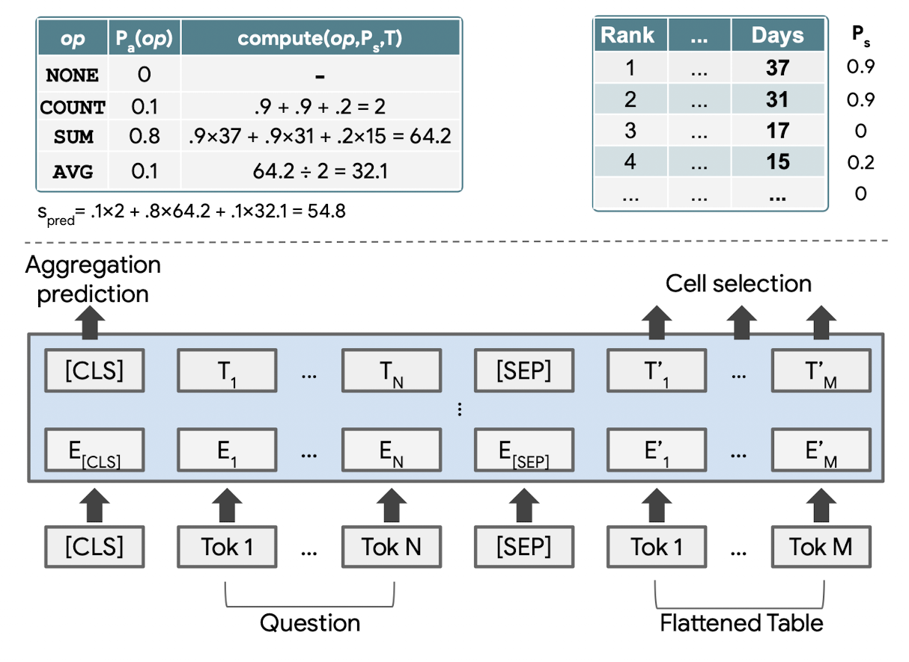

## Introduction

- Natural Language Querying (NLQ) is the process of querying DBs not in their specific querying language but using natural language text. One example could be to fetch results from a SQL table for question - `"Who is the Prime Minister of India?"` by just using the text and not some technical query like `select name from pm_table where country = "India"`.  
- There are two main reasons that makes this task important for any IaaS *(Information as a service)* product or SaaS,
  - Each DB has its own specific querying language. This is a nightmare even for developers, as they will have to gain expertise in mulitple DB languages.
  - Looking at a product from users perspective, it makes sense to let the user query in the language they prefer and not the technical query languages suitable for each DBs.

## Different Approaches

- Usually there are two approaches to create a NLQ system, 
  - **Query creator:** this is a multi-step process where we first convert the natural text to DB specific language query. This step in itself could have multiple sub steps where we identify entities and intent from the query and then match them with the available data in table. Later we execute the query on the DB and get the data. 
  - **Answer extractor:** this is a single step process, usually built completely of neural networks, where the data and question are passed to the network and output is returned. Think of it like closed-book QA systems in NLP, where we pass the context (here the DB table) and the question (query) and the model returns us the answer. We could add wrapper on the output to handle complex queries with COUNT, AVERAGE, etc.


``` mermaid
graph LR
  A("What is the size of the data?") --> B(NLQ system)
  B -- Query creator --> C("Select count(*) from table")
  C -- querying DB --> E("5")
  B -- Answer extractor --> D("5")
  style B stroke:#f66,stroke-width:2px,stroke-dasharray: 5 5
```

!!! Note
    NLQ, as a topic, is DB agnostic. But in reality different NLQ systems are built for specific DBs for example SQL, SPARQL, MongoDB QL, etc.


## Code

- Let us explore the different ready made solutions for NLQ.

### TaPaS

- [TaPas](https://huggingface.co/google/tapas-base-finetuned-wtq) follows Answer extractor based approach to perform NLQ that utilizes specially trained BERT like transformer. Tapas takes the question and table in the format inspired from BERT like `[CLS] Question [SEP] Flattened table [SEP]`. The answer is selected from the table based on the question.
- The model was first pre-trained using unlabeled data on tasks like Masked Language modeling and Sentence-Table support/refute prediction. Later, it was finetuned on datasets like WikiSQL, WTQ and other to perform NLQ. 

<figure markdown> 
    { width="500" }
    <figcaption>Illustration of the TaPas model for one example ([TaPas paper](https://arxiv.org/abs/2004.02349))</figcaption>
</figure>

- One interesting differentiator of TaPas is the unique formatting and encoding of the query and the table. As a table contains values spread across columns and rows, special column, rows and segment embeddings are added to the input to make the model learn the proper context. One example is shown below, 
  
<figure markdown> 
    
    <figcaption>Encoding process of sample query and table in TaPas ([TaPas paper](https://arxiv.org/abs/2004.02349))</figcaption>
</figure>

!!! Note
    As TaPas was pre-trained using self-supervised learning on unlabled data, it learned the concept of relationship between text and table. Hence, it can be used (finetuned) for other table-text related downstream tasks as well like refute or support the text based on content in table, etc.


- Let's get started with the code part. For TAPAS to work, we need to install `torch-scatter`. For this, we first install pytorch using `pip install torch` and then get the version of torch using `torch.__version__`. Next we install `torch-scatter` by replacing the version of torch in  `pip install torch-scatter -f https://pytorch-geometric.com/whl/torch-1.12.0+cu102.html`

``` python linenums="1"
# install required packages
!pip install -q transformers==4.4.2 torch pandas
!pip install torch-scatter -f https://pytorch-geometric.com/whl/torch-1.12.0+cu102.html

# import
import pandas as pd
from transformers import pipeline

# load pipeline
nlq_tapas = pipeline(task="table-question-answering", 
                     model="google/tapas-base-finetuned-wtq")

# load the data
data = pd.read_csv("../data/pm_table.csv") # use your table here
data = data.astype(str)

# query the table
query = "Who is the Prime Minister of India?"
answer = nlq_tapas(table=data, query=query)['answer']
print(answer)
# Output: "Narendra Modi" (at the time of writing)
```

!!! tip
    Personal opinion - TAPAS's accuracy is quite good wrt TableQA, but the major drawback is that it only works for small tables. Hence, forget about using it for industry use case with larger tables.

### TableQA

- [TableQA](https://github.com/abhijithneilabraham/tableQA) follows Query creator approach to build an AI tool for querying natural language on tabular data. While the approach was released rather recently *(Jan 2022)*, it's performance is comparable or worse than TaPas. As per the authors, TableQA shines when it comes to NLQ on large tables and complex queries.
- It is more of a framework consisting of mulitple modules. The complete process consists of components like table selector, known fields extractor, unknown fields extractor, and agreegator function classifer and SQL generator.


<figure markdown> 
    { width="600" }
    <figcaption>System architecture of TableQA ([TableQA paper](https://arxiv.org/abs/2202.00454))</figcaption>
</figure>

- Let's get TableQA running with following code, 

``` python linenums="1"
# install required packages
!pip install -q tableqa nltk

# import packages
import nltk
import pandas as pd
from tableqa.agent import Agent

# download nltk data
nltk.download('omw-1.4')

# load a CSV
df = pd.read_csv("my_csv_file.csv")

# create an agent
agent = Agent(df)

# create query
query = "how many data points in 2011?"
# get the SQL query
agent.get_query(query)
# get the answer
agent.query_db(query)
```

## Additional materials

- [How to Talk to Your Database - Salesforce](https://blog.salesforceairesearch.com/how-to-talk-to-your-database/)
- [Stack Exchange: Natural Language to SQL query](https://datascience.stackexchange.com/questions/31617/natural-language-to-sql-query)

Cheers :wave: