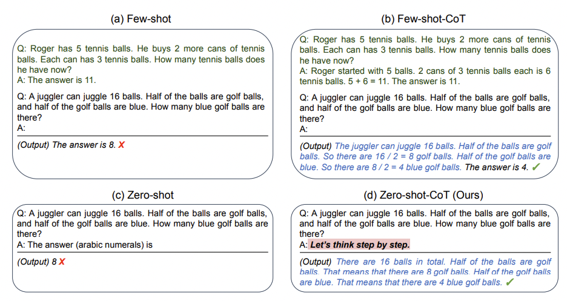
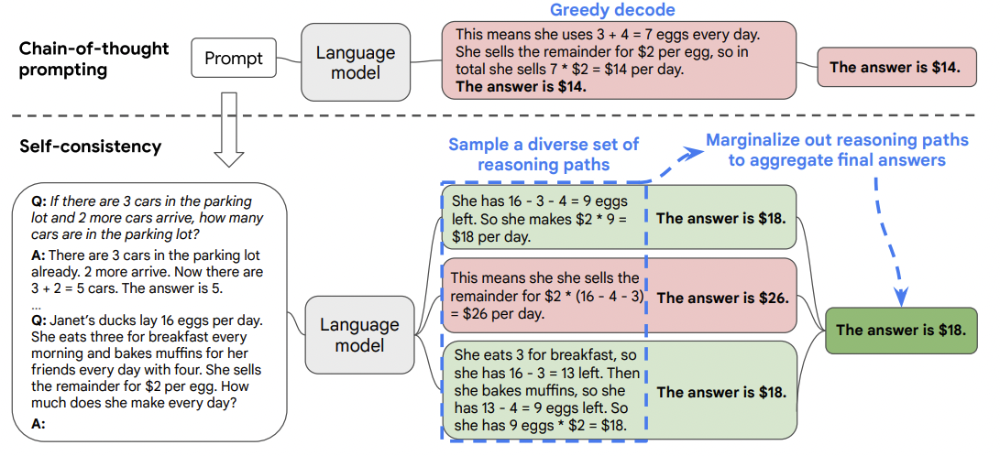
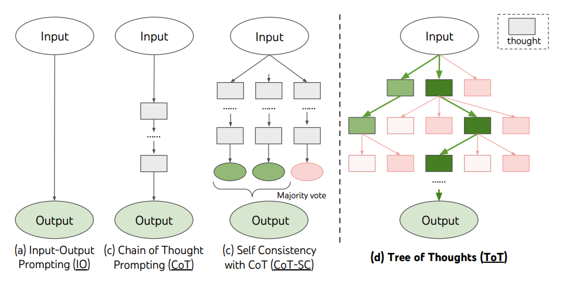

!!! warning
    This page is still ongoing modifications. Please check back after some time or [contact me](mailto:mohitmayank1@gmail.com) if it has been a while! Sorry for the inconvinence :pray:

# Prompt Engineering in LLMs

## Introduction

Prompt engineering involves crafting well-defined and strategically designed input queries to elicit desired responses from AI systems. It serves as a bridge between human intention and machine understanding, enabling AI models to provide more accurate and contextually relevant outputs. As AI applications continue to proliferate across various domains, mastering the art of prompt engineering has become essential for both developers and users.  What makes prompt engineering more tempting is that it does not require any finetuning of the model but nevertheless, it can enhance the model accuracy substantially! In this article, we will explore different key strategies for crafting effective prompts that enhance AI model capabilities.

## Types of Prompts

Before getting started, let’s discuss the two main types of prompts used in prompt engineering,

### System Prompts

System prompts are like global settings that are applied once and set the mood and intention of the AI model’s subsequent generations in the same chat. These prompts are carefully crafted by developers to guide the AI system toward specific outputs that align with the intended use case. ChatGPT UI’s custom instruction is a good example of a system prompt, as whatever you mention there is applicable to all your chats. Users can provide details to format output in a certain format (like JSON), provide details about themselves so that the responses are personalized, set the tone or mood of the generation, define privacy and ethics details, and much more! An example is shown below

```ts
System Prompt:
You are a helpful AI Assistant. Help users in replying to their queries and make 
sure the responses are polite. Do not hallucinate and say "I don't know" if required.
```

### User Prompts

User prompts are generated on the fly by users and are designed to elicit specific responses to their queries. Unlike system prompts, user prompts are not pre-defined and can vary widely in structure and content. These are more transactional in nature, and are usally present after system prompt and could be mulitple in count.

```sql
System Prompt:
You are a helpful AI Assistant. Help users in replying to their queries and make 
sure the responses are polite. Do not hallucinate and say "I don't know" if required.

User Prompt:
What is your name?
```

### Assistant Output

These are AI’s generated output to the System and previous user prompts. In complex use cases, developers can modify this as an example to the AI model to highlight the kind of result expected from the model. 

```sql
System Prompt:
You are a helpful AI Assistant. Help users in replying to their queries and make 
sure the responses are polite. Do not hallucinate and say "I don't know" if required.

User Prompt:
What is your name?

Assistant:
I am an AI Assistant that can help you with your queries. Please let me know your questions!
```

## Prompt Strategies

### Zero-Shot Prompts

Zero-shot prompts are a fundamental technique in prompt engineering, allowing AI models to provide meaningful responses without any specific training examples. With zero-shot prompts, developers and users can harness the model's innate knowledge and reasoning capabilities to answer questions or complete tasks, even if the model has never seen similar queries before. When using a zero-shot prompt, formulate your question or request as clearly and concisely as possible. You can even provide some context if that helps, overall avoid ambiguity to help the model understand your intention accurately.

```sql
Example 1 - Clear instructions
################
User Prompt:
Translate the following English text to French: "Hello, how are you?"

Example 2 - Provide context
################
User Prompt:
Calculate the total revenue for our company in the last quarter, given the following financial data: [insert data].
```

Note, deciding which data should go where (system or user prompt) depends on experimenting how it works for a specific model but a general thumb rule is to keep the constant details on system prompt and dynamic details on user prompt. In the first example above, we can also have following prompts

```sql
Example 1 - Clear instructions with System prompt
################
System prompt: 
You are a Translator GPT. Given a sentence in English, translate it into French.

User prompt:
"Hello, how are you?"
```

### Few-Shot Prompts

While zero-shot prompts are fundamental, there are situations where you may need to provide a bit more guidance to the AI model. In such cases, you can use few-shot prompts that involve providing a small number of examples or demonstrations to help the model understand the desired task or context. Developers can use this approach to further guide the AI model's responses. One example of 2-shot prompt is shown below, 

```sql
System prompt: 
You are a Translator GPT. Given a sentence in English, translate it into French. Examples are shared below,

English: "Hello, how are you?"
French: "Bonjour, comment ça va ?"

English: "I am learning French."
French: "J'apprends le français."

User Prompt:
English: "Please pass the salt."
French: 
```

Note, the number of examples to be included (n-shot) is highly experimental. The objective should be to keep the example number as small as possible (otherwise the token size and cost will increase) while making sure the accuracy is not impacted. So the prompt design should be done incrementally, i.e. keep adding more examples if the accuracy is below expectations. Also, make sure to add diverse examples and do not add exact or even semantically similar examples as latest LLMs are quite “smart” enough to learn from few examples.

### Few-shot Chain-of-Thought Prompt

Few shot CoT Prompting was introduced in [1] and the idea is that generating a chain of thought, i.e. a series of intermediate reasoning steps, can significantly improves the ability of large language models to perform complex reasoning. Experiments shows that chain-of-thought prompting improves performance on a range of arithmetic, commonsense, and symbolic reasoning tasks. Basically it is clubbed with few shot prompt where the examples are provided in CoT format. Example is shown in the below image, 

<figure markdown> 
    
    <figcaption>Example inputs and outputs for Standard 1-shot prompt and CoT prompts</figcaption>
</figure>


### Zero-shot Chain-of-Thought Prompt

Zero shot variant of CoT was introduced in [2] and it indicates significant increase in accuracy even if you do not provide any examples. All you need to do it to add “Let’s think step by step.” 😜 

<figure markdown> 
    
    <figcaption>Example inputs and outputs of GPT-3 with (a) standard Few-shot, (b) Few-shot-CoT, (c) standard Zero-shot, and (d) Zero-shot-CoT</figcaption>
</figure>

### Self-consistency

Self-consistency is based on the idea that there are multiple ways to solve a complex problems i.e. if multiple reasoning paths are leading to samethe output, it is highly probable that it is a correct answer. In their own words, *"...we hypothesize that correct reasoning processes, even if they are diverse, tend to
have greater agreement in their final answer than incorrect processes."*. The self-consistency method consists of three steps:

1. prompt a language model using chain-of-thought (CoT) prompting;
2. replace the “greedy decode” in CoT prompting by sampling from the language model’s decoder to generate a diverse set of reasoning paths; and 
3. marginalize out the reasoning paths and aggregate by choosing the most consistent answer in the final answer set.

The authors of the paper performed extensive empirical evaluations to shows that self-consistency boosts the performance of chain-of-thought prompting on a range of popular arithmetic and commonsense reasoning
benchmarks, including GSM8K (+17.9%), SVAMP (+11.0%), AQuA (+12.2%), StrategyQA (+6.4%) and ARC-challenge (+3.9%).

<figure markdown> 
    
    <figcaption>CoT vs Self-consistency prompting example</figcaption>
</figure>

### Tree-of-Thoughts

Tree-of-Thoughts (ToT) [4] is based on the idea that to solve any complex problem we need to (a) explore multiple reasoning paths *(branches in a graph)*, and (b) perform planning i.e. lookahead or even backtrack on the paths if required. ToT frames any problem as a search over a tree, where each node is a state `s = [x, z1···i]` representing a partial solution with the input and the sequence of thoughts so far. A specific instantiation of ToT involves answering four questions: 

1. How to decompose the intermediate process into thought steps -- depending on different problems, a thought could be a couple of words (Crosswords), a line of equation (Game of 24), or a whole paragraph of writing plan (Creative Writing). In general, a thought should be “small” enough so that LMs can generate promising and diverse samples.
2. How to generate potential thoughts from each state -- again it depends on the problem, so for Creative writing we can sample thoughts from a CoT prompt and for Game of 24 and Crosswords we can propose thoughts sequentially using propose prompt.
3. How to heuristically evaluate states -- this can be done automatically by either asking the model to generate a value *(score between 1 to 10 or class of sure/likely/impossible)* or voting on different results.
4. What search algorithm to use -- authors propose Breadth-first search (BFS) and Depth-first Search (DFS) and left more complex search algorithms like A* for future works.

<figure markdown> 
    
    <figcaption>Schematic illustrating various approaches to problem solving with LLMs. Each rectangle box represents a thought, which is a coherent language sequence that serves as an intermediate step toward problem solving</figcaption>
</figure>

<!-- ### Retrieval Augmented Generation (RAG)

TODO

### ReAct

TODO

### Graph Prompts

TODO -->

## Conclusion

Prompt engineering is a crucial skill for leveraging the capabilities of LLMs effectively. By understanding the different types of prompts and employing strategies such as zero-shot prompts, few-shot prompts, etc, developers and users can harness the power of AI to achieve more accurate and contextually relevant responses. As AI technologies continue to evolve, mastering prompt engineering will remain an essential tool for unlocking the full potential of AI systems across various domains.

## References

[1] [Chain-of-Thought Prompting Elicits Reasoning in Large Language Models](https://arxiv.org/abs/2201.11903)

[2] [Large Language Models are Zero-Shot Reasoners](https://arxiv.org/pdf/2205.11916.pdf)

[3] [Self-consistency improves chain of thought reasoning in language models](https://arxiv.org/pdf/2203.11171.pdf)

[4] [Tree of Thoughts: Deliberate Problem Solving with Large Language Models](https://arxiv.org/pdf/2305.10601.pdf)