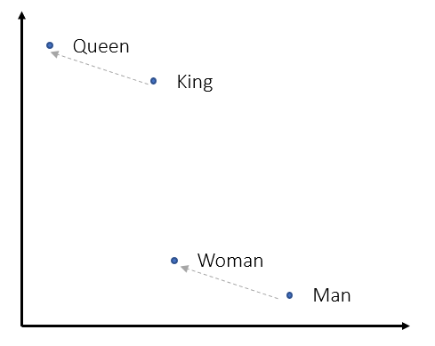

- Word2Vec (w2v) [1] is a word embedding technique that represents a word as a vector. Each vector can be thought of as a point in $R^{D}$ space, where $D$ is the dimension of each vector. 
- One thing to note is that these vectors are not randomly spread out in the vector space. They follow certain properties such that, words that are similar like "cat" and "tiger" are relatively closer to each other than a completely unrelated word like "tank". 
- In the vector space, this means their cosine similarity score is higher. Along with this, we can even observe famous analogies like $king - man + woman = queen$ which can be replicated by vector addition of these word's representation vector.

<figure markdown> 
    
    <figcaption>Vector space representing the position of word’s vector and the relationship between them to showcase the analogy king-man+woman=queen
    </figcaption>
</figure>

- While such representation is not unique to w2v, its major contribution was to provide a simple and faster neural network based word embedder. 
- To do so, w2v transformed the training as a classification problem where given one word, the neural network tries to answer which word is most probable to be found in the context of the given word. This technique is formally called Skip-gram, where input is the middle word and output is context word. This is done by creating a 1-layer deep neural network where the input word is fed in one-hot encoded format and output is softmax with ideally large value to context word.

<figure markdown> 
    
    <figcaption>SkipGram architecture (taken from Lil’Log [2]). Its a 1 layer deep NN with input and output as one-hot encoded. The input-to-hidden weight matrix contains the word embeddings.</figcaption>
</figure>

- The training data is prepared by sliding a window (of some window size) across the corpus of large text (which could be articles or novels or even complete Wikipedia), and for each such window the middle word is the input word and the remaining words in the context are output words. 
- For each input word in vector space, we want the context words to be close but the remaining words far. And if two input words will have similar context words, their vector will also be close. 
- Word2Vec also performs negative sampling, wherein random selection of some negative examples are also added in the training dataset. For these examples, the output probabilities should be $0$. [4]
- After training we can observe something interesting — the weights between the Input-Hidden layer of NN now represent the notions we wanted in our word embeddings, such that words with the same context have similar values across vector dimension. And these weights are used as word embeddings.

<figure markdown> 
    
    <figcaption>Heatmap visualization of 5D word embeddings from Wevi [3]. Color denotes the value of cells.</figcaption>
</figure>

- The result shown above is from training 5D word embeddings from a cool interactive w2v demo tool called "Wevi" [3]. 
- As visible, words like (juice, milk, water) and (orange, apple) have similar kinds of vectors (some dimensions are equally lit — red or blue). 

!!! Hint
    One obvious question could be -- why do we only use Input-Hidden layer for embedding and why not Hidden-Last? It seems we can use both based on the type of task we are performing. For more details refer the paper -- [Intrinsic analysis for dual word embedding space models](https://arxiv.org/pdf/2012.00728.pdf)

### References

[1] [Efficient Estimation of Word Representations in Vector Space](https://arxiv.org/abs/1301.3781)

[2] [Lil’Log — Learning word embedding](https://lilianweng.github.io/lil-log/2017/10/15/learning-word-embedding.html)

[3] [Wevi](https://ronxin.github.io/wevi/) — word embedding visual inspector

[4] [Word2Vec Tutorial Part 2 - Negative Sampling](http://mccormickml.com/2017/01/11/word2vec-tutorial-part-2-negative-sampling/)

### Additional Materials

- [Intrinsic analysis for dual word embedding space models](https://arxiv.org/pdf/2012.00728.pdf)